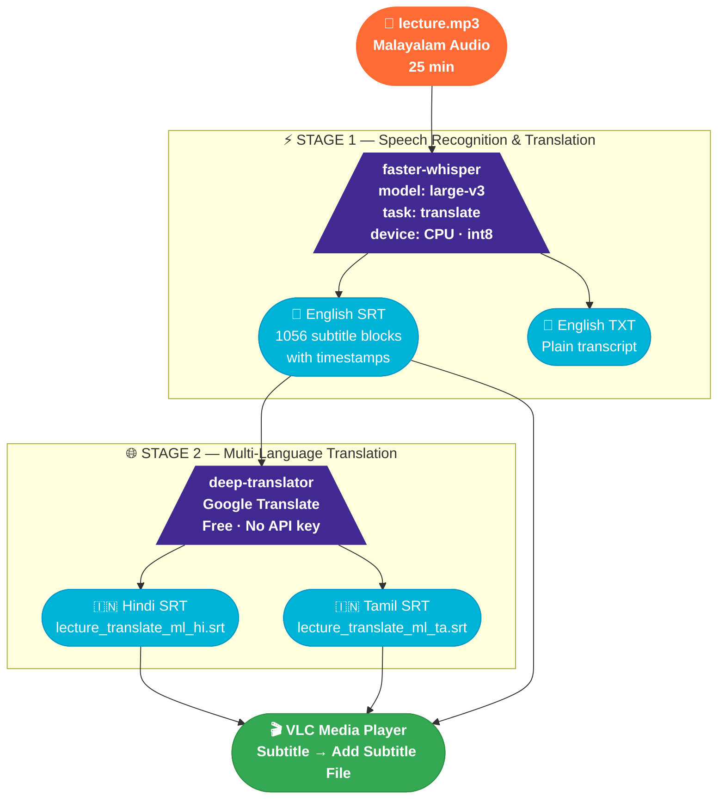
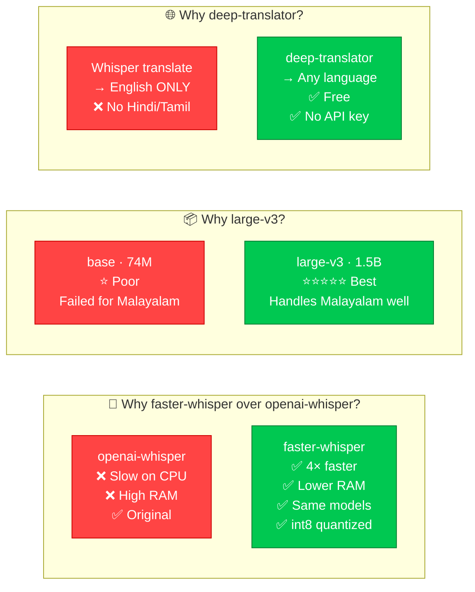
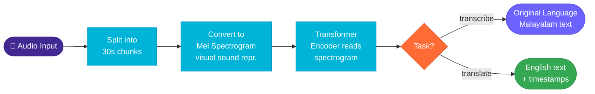
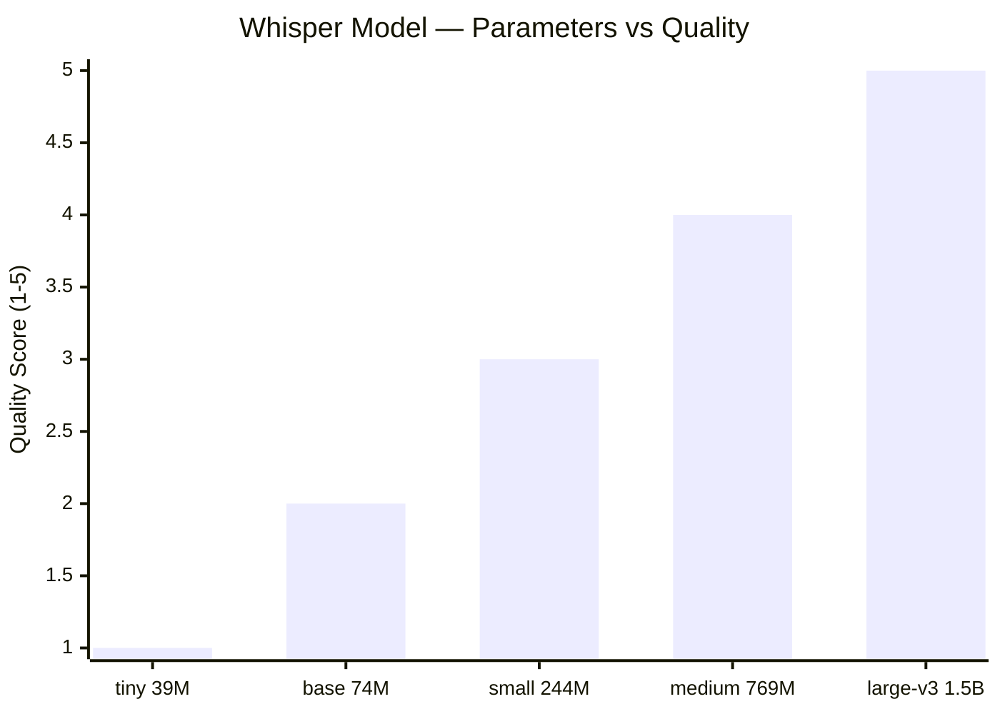
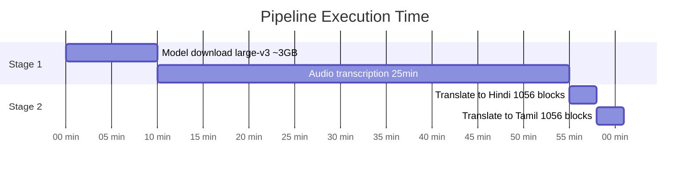
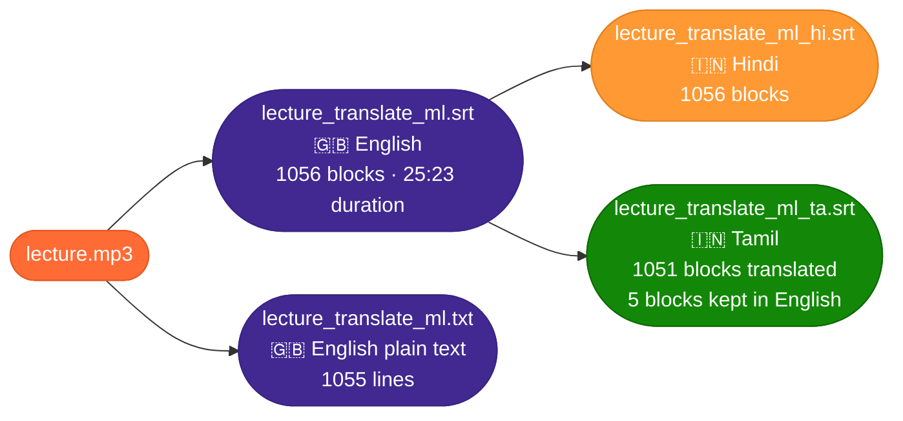

# 🎙️ Eduport Whisper Pipeline

<p align="center">
  
  
  
  
  
</p>

> Convert Malayalam lecture audio into multi-language subtitle files (`.srt`) using OpenAI Whisper — runs fully local, zero paid API.

---

## 🗺️ Full Pipeline



---

## 🔬 Why These Tools?



---

## 🧠 How Whisper Works Internally



---

## 📊 Model Comparison



| Model | Params | Malayalam Quality | CPU Time (25 min audio) | Used? |
|---|---|---|---|---|
| `tiny` | 39M | ⭐ | ~3 min | ❌ |
| `base` | 74M | ⭐⭐ | ~8 min | ❌ First test, bad output |
| `small` | 244M | ⭐⭐⭐ | ~15 min | ❌ |
| `medium` | 769M | ⭐⭐⭐⭐ | ~30 min | ❌ |
| `large-v3` | 1.5B | ⭐⭐⭐⭐⭐ | ~45 min | ✅ **Final choice** |

---

## ⏱️ Performance (Intel i5, Ubuntu, CPU only)



| Task | Tool | Time |
|---|---|---|
| Download `large-v3` model | HuggingFace (one time) | ~5–10 min |
| Transcribe + translate 25 min audio | faster-whisper CPU | ~45 min |
| Generate Hindi SRT (1056 blocks) | deep-translator | ~3 min |
| Generate Tamil SRT (1056 blocks) | deep-translator | ~3 min |
| **Total end-to-end** | | **~51 min** |

---

## 📤 Output Files



---

## 🔗 Model & Library References

| Tool | Repository | Purpose |
|---|---|---|
| **OpenAI Whisper** | [github.com/openai/whisper](https://github.com/openai/whisper) | Original model creator |
| **faster-whisper** | [github.com/SYSTRAN/faster-whisper](https://github.com/SYSTRAN/faster-whisper) | Faster reimplementation used here |
| **large-v3 weights** | [huggingface.co/Systran/faster-whisper-large-v3](https://huggingface.co/Systran/faster-whisper-large-v3) | Model downloaded from here |
| **deep-translator** | [github.com/nidhaloff/deep-translator](https://github.com/nidhaloff/deep-translator) | Hindi/Tamil translation |

---

## 🗂️ Repository Structure

```
whisper_eduport_testing/
│
├── 📄 transcribe.py          # Stage 1: Audio → English SRT + TXT
├── 📄 translate_srt.py       # Stage 2: English SRT → Hindi / Tamil SRT
├── 📄 .gitignore             # Excludes venv, audio, generated files
└── 📄 README.md              # This file
```

> Audio files, generated `.srt`/`.txt` outputs, and `whisper-env/` are excluded from this repo.

---

<p align="center">
  <i>Built for Eduport · Malayalam lecture transcription pipeline</i>
</p>
